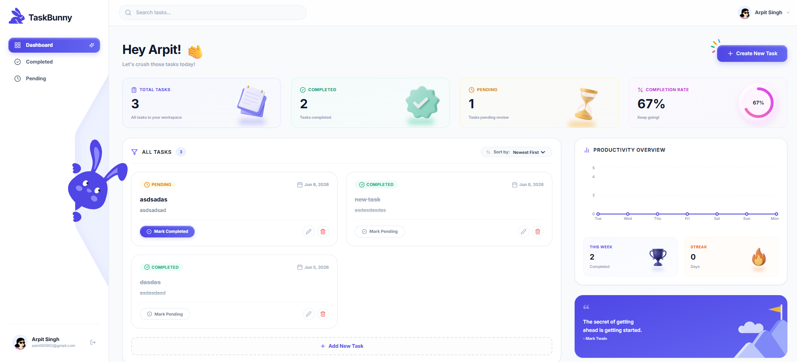

# TaskBunny - Premium Task Management System

TaskBunny is a production-ready, secure, and responsive Task Management Application built using the MERN stack (MongoDB, Express, React 19, Node.js, and TypeScript).

It features an interactive dashboard with dynamic task completion metrics, timezone-aware analytics, custom micro-interactions, and a sleek, premium UI styled with Tailwind CSS.




---

## Key Features

### 🐰 Interactive Mascot & Micro-Interactions

- **Mascot Eye-Tracking**: The SVG bunny mascot decoration dynamically tracks cursor movements in real-time.
- **Hover Micro-Animations**: Pupils grow larger and cheeks turn a warm blush red (`#F87171`) with smooth CSS transitions whenever a user hovers over any task creation button.

### 📈 Dynamic Productivity Analytics

- **Recharts Line Chart**: Real-time weekly task completion counts rendered with smooth gradients and custom tooltips.
- **Timezone-Aware Aggregations**: The backend groups completed tasks by date dynamically adjusted to the client's local timezone.
- **Consecutive Completion Streak**: An active streak calculator that checks consecutive days with task completions backwards from today.

### 🎛️ Advanced Task Management

- **Full CRUD Operations**: Create, view, update title/description/status, and delete tasks.
- **Filters & Search**: Fast client-side sorting (newest, oldest, alphabetical), status filters (all, completed, pending), and debounced search queries.
- **Client & Server Pagination**: Server-side limits and page counters combined with responsive UI navigations.

### 🛡️ Production Security

- **JWT Authentication**: Secure session access via JSON Web Tokens.
- **Password Hashing**: Pre-save model hooks hashing passwords with `bcrypt`.
- **Rate Limiting**: Prevent brute force attacks by limiting requests (auth paths capped at 30 per 15 minutes, global API capped at 100 per 15 minutes).
- **Security Middlewares**: Helmet headers, CORS restrictions, and request parameters sanitized via `express-validator` schema rules.

---

## Folder Structure

```bash
task-manager/
├── backend/                  # Node/Express API Server (TypeScript)
│   ├── src/
│   │   ├── config/           # Database configurations
│   │   ├── controllers/      # Route request controllers (auth, task, analytics)
│   │   ├── middleware/       # Auth guards, error handler, rate limiters
│   │   ├── models/           # Mongoose schemas (User, Task)
│   │   ├── routes/           # Router groups (auth, tasks)
│   │   ├── types/            # TypeScript type declarations
│   │   └── server.ts         # Server entry point
│   ├── tsconfig.json         # Server TS compiler configuration
│   └── .env.example          # Environment variables template
│
├── frontend/                 # Vite Client Application (React 19 + TS)
│   ├── src/
│   │   ├── api/              # Axios client and endpoint queries
│   │   ├── components/       # Common UI elements, dashboard modules, mascot
│   │   ├── pages/            # Login, Register, Dashboard views
│   │   ├── routes/           # Protected routing elements
│   │   ├── store/            # Auth state providers
│   │   ├── types/            # Client TS type declarations
│   │   └── main.tsx          # Client entry point
│   ├── tailwind.config.js    # Tailwind colors and shadow specifications
│   └── tsconfig.json         # Client TS compilation rules
│
└── package.json              # Monorepo command runner
```

---

## API Endpoints

### Authentication Routes (`/api/auth`)

| Method         | Endpoint      | Description                | Request Body                  | Auth Required                |
| :------------- | :------------ | :------------------------- | :---------------------------- | :--------------------------- |
| **POST** | `/register` | Create a user account      | `{ name, email, password }` | No                           |
| **POST** | `/login`    | Log in to an account       | `{ email, password }`       | No                           |
| **GET**  | `/profile`  | Retrieve user profile data | *None*                      | **Yes (Bearer Token)** |

### Task & Analytics Routes (`/api/tasks`)

| Method           | Endpoint        | Description                      | Query Parameters / Body                                                     | Auth Required                |
| :--------------- | :-------------- | :------------------------------- | :-------------------------------------------------------------------------- | :--------------------------- |
| **GET**    | `/`           | Fetch all user tasks             | `page`, `limit`, `status` ("pending"\|"completed"\|"all"), `search` | **Yes (Bearer Token)** |
| **GET**    | `/analytics`  | Get daily task completion counts | `timezone` (e.g. "Asia/Kolkata")                                          | **Yes (Bearer Token)** |
| **POST**   | `/`           | Create a task                    | `{ title, description }`                                                  | **Yes (Bearer Token)** |
| **GET**    | `/:id`        | Get details of a single task     | *None*                                                                    | **Yes (Bearer Token)** |
| **PUT**    | `/:id`        | Update task details              | `{ title, description, status }`                                          | **Yes (Bearer Token)** |
| **PATCH**  | `/:id/status` | Toggle task status               | `{ status }` ("pending"\|"completed")                                     | **Yes (Bearer Token)** |
| **DELETE** | `/:id`        | Delete a task                    | *None*                                                                    | **Yes (Bearer Token)** |

---

## Local Installation Guide

### Prerequisites

- [Node.js](https://nodejs.org/) (v18 or higher recommended)
- [MongoDB](https://www.mongodb.com/) (Local server or Atlas URI connection)

### Setup Steps

1. **Clone the repository**:

   ```bash
   git clone <repository-url>
   cd task-manager
   ```
2. **Install all dependencies**:
   Run the monorepo helper script to install root, backend, and frontend packages simultaneously:

   ```bash
   npm run install:all
   ```
3. **Configure Environment Variables**:
   Create a `.env` file inside the `backend/` directory:

   ```bash
   cd backend
   cp .env.example .env
   ```

   *Example configuration (`backend/.env`):*

   ```ini
   PORT=5000
   NODE_ENV=development
   MONGO_URI=mongodb://localhost:27017/taskbunny
   JWT_SECRET=your_super_secret_jwt_key
   JWT_EXPIRES_IN=7d
   CLIENT_URL=http://localhost:5173
   ```
4. **Launch Application (Development Mode)**:
   Return to the root directory and start both development servers concurrently:

   ```bash
   cd ..
   npm run dev
   ```

   - **Backend API**: `http://localhost:5000`
   - **Frontend App**: `http://localhost:5173`
5. **Build for Production**:
   To compile and build both client and server:

   ```bash
   npm run build
   ```

---

## Deployment Guide

### Database (MongoDB Atlas)

1. Sign up on [MongoDB Atlas](https://www.mongodb.com/cloud/atlas) and create a database cluster.
2. Whitelist access from all IPs (`0.0.0.0/0`) in the Network Access tab.
3. Retrieve your DB connection string and use it as the `MONGO_URI` value in production.

### Backend API (Render)

1. Link your repository to [Render](https://render.com/).
2. Select **New Web Service** and configure:
   - **Root Directory**: `backend`
   - **Build Command**: `npm install && npm run build`
   - **Start Command**: `npm start`
3. Configure environment variables (`MONGO_URI`, `JWT_SECRET`, `JWT_EXPIRES_IN`, `CLIENT_URL`, etc.).

### Frontend App (Vercel)

1. Link your repository to [Vercel](https://vercel.com/).
2. Choose Vite preset and configure:
   - **Root Directory**: `frontend`
   - **Build Command**: `npm run build`
   - **Output Directory**: `dist`
3. Deploy!
